=====================================
 v1.11.4 User Guide: Take Flight! ✈️
=====================================

A (very) basic rundown of the experimental runtime is included below.

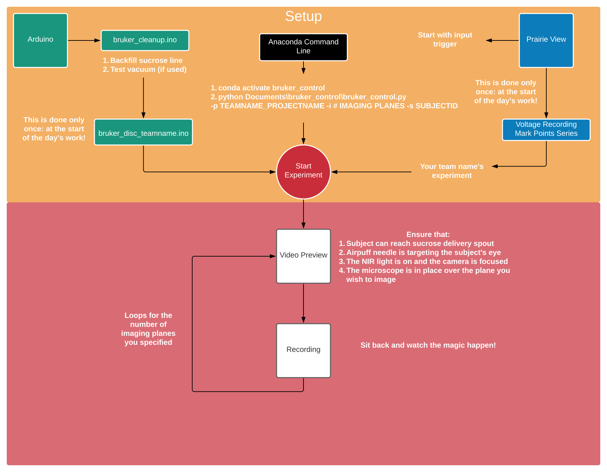

##########
User Guide
##########

There are three different softwares used for running experiments with the lab's Bruker Ultima Investigator: *Python*, *Arduino Sketches*, and Bruker's *Prairie View*.

*********
*Arduino*
*********

First, use ``bruker_cleanup.ino`` to backfill the sucrose line.

1. Comment out all the lines in the `loop` portion of the file with `//` characters at the start of the line **except** for the `digitalWrite(solPin_liquid, HIGH)` line.
   
  * Assist the sucrose solution through the line with the syringe plunger until it is flowing continuously through the sucrose delivery needle in the faraday cage. It takes approximately 5mL of solution to backfill the line.

2. Uncomment the rest of the lines in the `loop` to test the vacuum. If the droplet is sucked up properly, you can move forward!

  * If it fails, first try drying the sucrose delivery needle and, if that fails, grease the interface between the two needles. Ensure that you don't get any grease where the sucrose droplet forms.

Once backfilled, the Arduino is nearly ready to run the experiment! ``bruker_control`` now checks that experimental script compiles and uploads the sketch for you.

If you watch the Serial Monitor during the experiment, do *NOT* open it now. Wait until after you see that the script has uploaded successfully in the terminal.

**************
*Prairie View*
**************

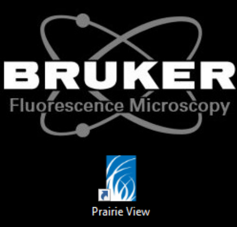

Prairie View will open several windows when it starts. The first looks like this:

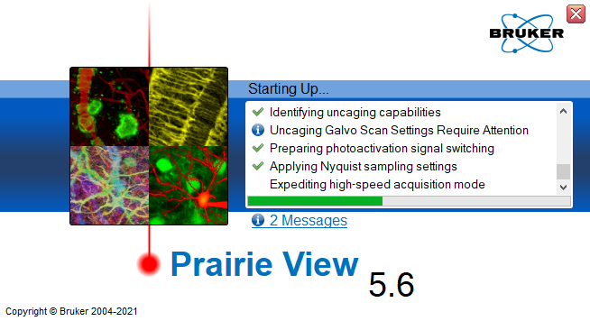

In the currently running version (5.7.64.200), two messages will appear related to unused PMT shutters and uncaged galvo settings requiring attention

These has no influence upon the function of the system and can be ignored. Documentation about why they are shown is forthcoming.

The next windows are the primary windows for Prairie View: The Control Suite and Image Display.

.. image:: ../images/pv_main_windows.png

The Control Suite is on the left and the Image Window is on the right. There are a few steps you'll need to do now to ensure the scope and Prairie View are ready.

1. Control Suite: T- Series

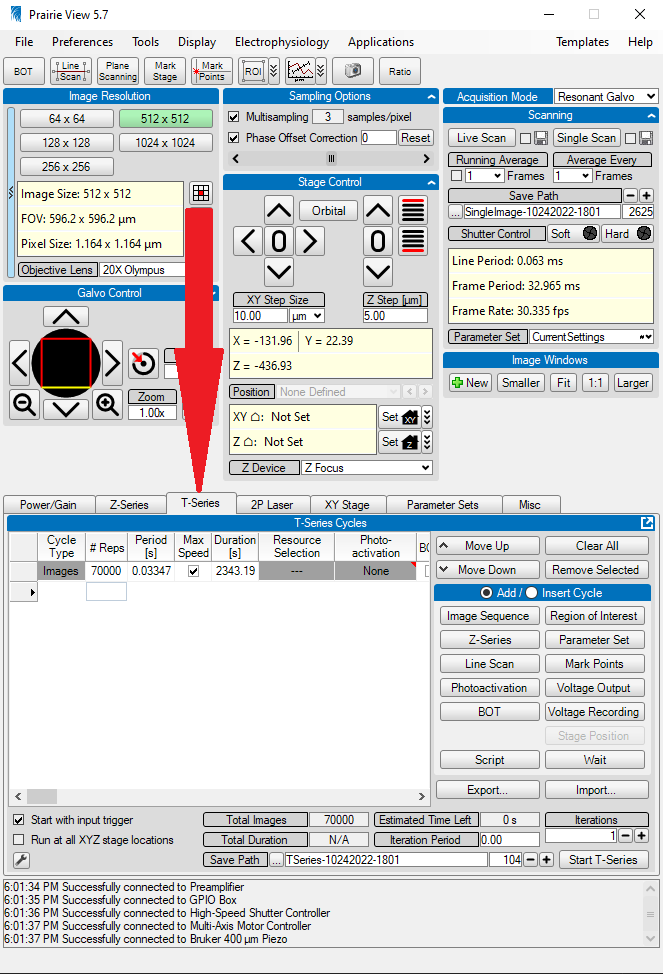

Multiple settings should be checked for correctness before initiating the experiment.

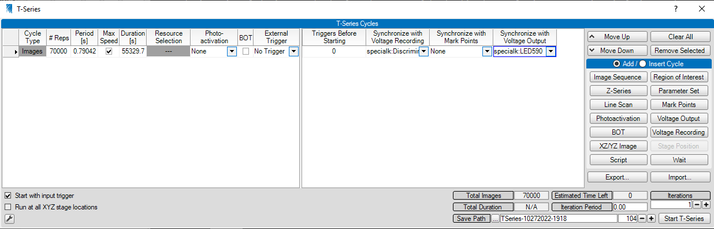

* On the bottom left corner of this tab, there is a checkbox  that states `Start with input trigger`. Make sure that this is selected.
* Make sure that there's a large number of images scheduled to be collected (>70k). This ensures that Prairie View will collect images for the full duration of the experiment. When the correct number of images are collected, `bruker_control` will send an `Abort` command to stop the experiment.
* Current users of the Legacy Ultima Investigator are imaging at Maximum Speed. Make sure that the `Max Speed` box is selected. The `Period` and `Duration` are set by recording at full speed with the number of images you've scheduled to collect.
* Photo Activation: Although we do photoactivation experiments currently with the whole field LED, we do not provide stimulation using this part of the software.
* Brightness Over Time (`BOT`): Measure the intensity of the image or hand selected ROI. Some labs do this when performing optogenetic stimulations to have a second reference of when stimulations occur. Users of this system do not currently use it.
* External Trigger: Whether to trigger a `BOT` measurement using an external trigger on the DAQ. This should be not be selected.
* Ensure that the `T-Series` is using the correct voltage recording experiment for your project and experiment before you start.
* If you are performing whole-field LED stimulations, ensure that the `Mark Points Series` is the correct one for team's experiment. These will have been configured ahead of time.

2. Preferences: Never Convert Images

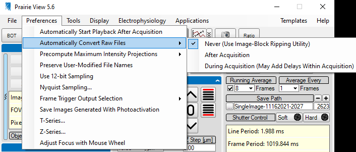

* Make sure that the `Never` option under the `Preferences/Convert Images` tab is selected.
  
  * This ensures that Prairie View will *not* convert the raw data into tiffs after the recording is complete. 

This process can take some time and Prairie View hangs until it is done. It can take 15-20 minutes to perform the conversion so you will not be able to start the next
subject until the ripping process is complete.

3. Voltage Recording Window

Select the Voltage Recording window from the `Electrophysiology Tab` to see the different experiments available on the system:

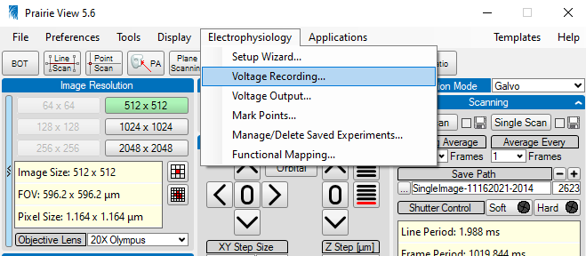

The voltage recording window will have multiple experiments saved for different teams' relevant DAQ channels. Select your team's appropriate experiment.

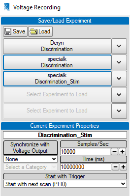

Now that the recording settings are correct, it's time to prep the laser. You will already likely have turned the laser box on and switched on the laser warning light. If you haven't do these things first before continuing!

4. The Laser

Prairie View has a tab specific for the laser. Select this tab.

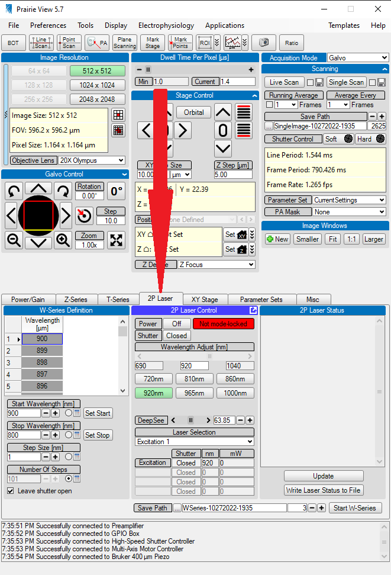

When you first select this window, you'll notice:

* The laser is "off". Even though you turned the laser's key to activate it, it is not yet fully powered and ready to interact with Prarie View.
* The laser is not "Mode Locked".
* The shutter is closed. This refers to the soft shutter.

First, click the `On` button.

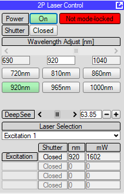

Notice that the box to the right is red and states "Not mode-locked". You can read more here about what that means and why we need to "Mode-Lock" here.

The mode locking procedure consists of cycling through wavelengths with the laser. Select the lowest wavelength button of 720nm first. It will take some time to get there.

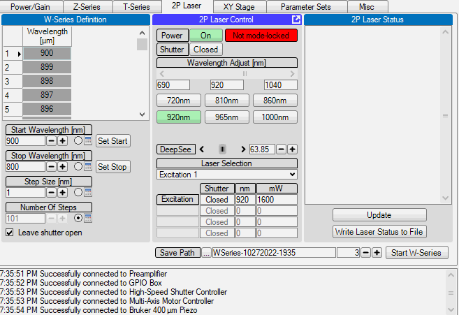

Next, select the highest wavelength button of 1000nm. This will also take some time to change. Sometimes on the way up the first time it will mode-lock as it does here. If it doesn't, just continue to cycle back and forth.

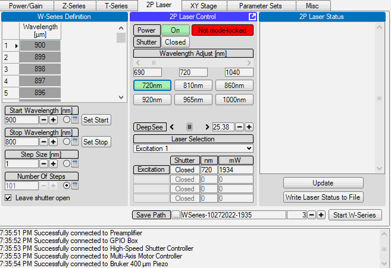

When on and mode-locked successfully, you should see something like this:

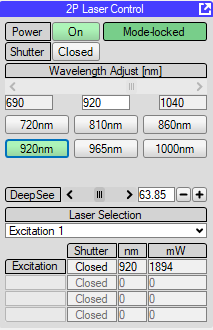

Now your laser is aligned and ready for imaging!

Before you move on, make sure that the lights in the room are off. Then, turn on the PMTs on the main box just below the keyboard and have the room lights off.

With these steps complete, you can move on to starting Python!

***************************
*Python and the Experiment*
***************************

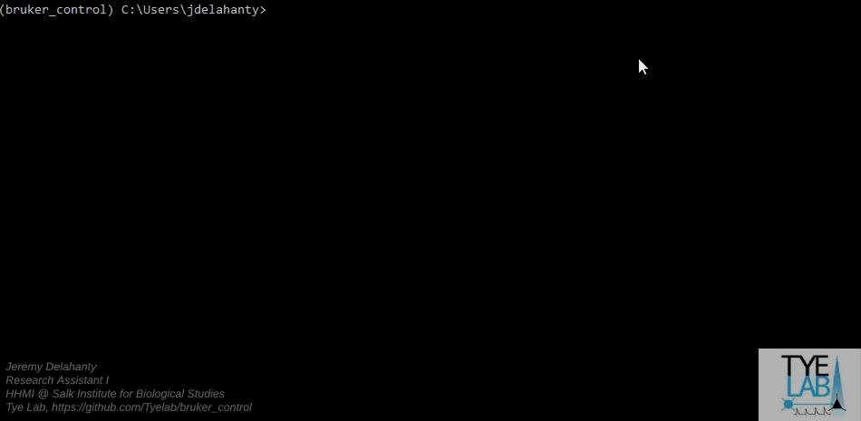

Use the `Anaconda Command Prompt` to start a Python Terminal and then type the following commands:

1. conda activate bruker_control

* Activating the conda environment `bruker_control` gives Python access to all the packages it needs to run the experiment.

1. ``python Documents\gitrepos\bruker_control\main\bruker_control.py -p TEAMNAME_PROJECT -i #IMAGINGPLANES -g EXPERIMENTAL_GROUP``

The different arguments on this command line mean...

* -p The teamname and project that is using the system (ie specialk_cs) *REQUIRED*
* -i The number of imaging planes that you plan to image for your subject *REQUIRED*
* -g The experimental group that the animal belongs to *OPTIONAL*

When you supply these arguments to the command line, a new small GUI appears and allows you to select mice from your given project that you plan to image that day! Thanks Jonny Saunders for teaching me how to do it! ❤️

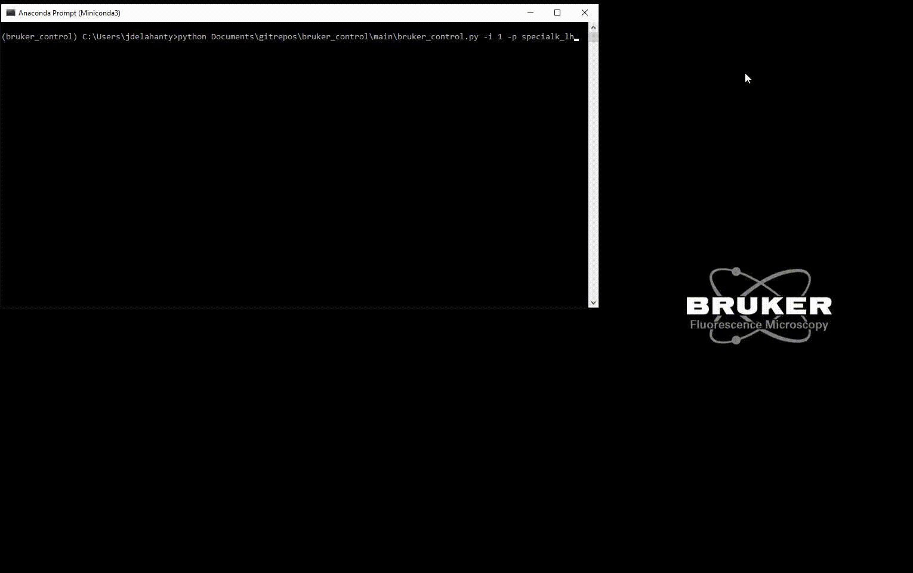

There's not a lot more you need to do at this point! `bruker_control` do the following steps: 

1. Load your project's configuration file
2. Locate your team's Arduino Sketch
3. Ensure that the Arduino you're using is properly connected and determine its properties
4. Compile your Arduino sketch to check for compilation errors
5. Upload the sketch to the board where it will await trials
6. Read the password file that allows Python to connect to Prairie View
7. Connect to Prairie View
8. Create trials according to your project's rules and settings
9. Connect to the machine vision camera for facial recordings
10. Display a Preview of the mouse's face with a grid drawn over it for aligning to initial recording day.
  * You may have already lined up the sucrose delivery needle and airpuff needles to their correct positions, but if you haven't now is when you should do that. 

.. image:: ../images/friend.gif
  :alt: What a subject might look like in the preview camera.
  :align: center

11. At this point you should also ensure that the microscope's objective is lined up over the lens and lowered to the plane you wish to image.
12. Double check that the values of your PMTs and Pockels are what you expect.
13. When you're certain you're ready to go and that the Farraday cage is completely closed, you can hit the `Esc` key. This will start the experiment!
14. Watch the magic happen!

At this point, `bruker_control` takes care of the rest! It will transmit the trial information to the Arduino, and tell Prairie View to start the recording session of the animal's face and brain activity.
It will write out the experiment's information into the ``E:`` drive appropriate for your team's raw data automatically so its ready for transferring to the server later.

****************************
*Using Yoked Configurations*
****************************

If you have your configuration file set to use yoked trials, you *must* use the ``EXPERIMENTAL_GROUP`` argument.
This gives ``bruker_control`` the final piece of information needed for generating yoked trial-sets: which group the subject belongs to.
Yoked configurations are uniquely generated for each group on each day for each plane. There are two valid options:

* ``exp`` - Experimental group
* ``con`` - Control group

The command for each subject will therefore look something like this for an experimental animal:

* ``python Documents\gitrepos\bruker_control\bruker_control.py -p deryn_fd -i 1 -s DOL1 -g exp``

And will look something like this for a control animal:

* ``python Documents\gitrepos\bruker_control\bruker_control.py -p deryn_fd -i 1 -s DOL1 -g con``

If you specified ``yoked=true`` in your configuration but *DONT* have the ``EXPERIMENTAL_GROUP`` argument, ``bruker_control`` will attempt to continue
forward anyways and crash. Implementing a check and useful error message if the check fails is currently underway.

*********************************
*Transferring Files to snlktdata*
*********************************

If your team has directories set for use on ``/snlktdata/_DATA/``, there's a ``.sh`` (shell script) that can automatically move your files to the server for you using a Linux
command called ``rsync`` through ``MobaXTerm``. It is simply called ``bruker_transfer_utility.sh``. Using it is simple after you open ``MobaXTerm`` and open a local terminal.

Once in the terminal, type the following:
``source ../Tyelab/MyDocuments/gitrepos/bruker_control/bruker_control/bruker_transfer_utility.sh TEAMNAME_PROJECT``

The commands in this line mean...

* source: This tells the Linux to run the file that is given to the command.
* ../Tyelab/MyDocuments/...: This is where the transfer utility is located in the git repository
*  TEAMNAME_PROJECT: This is the same as the -p argument in ``bruker_control``, the teamname and project (ie specialk_cs)

Once the transfer of the files is complete, you will receive an email message with the subject line "bruker_transfer_utility" that states the transfer is complete!
