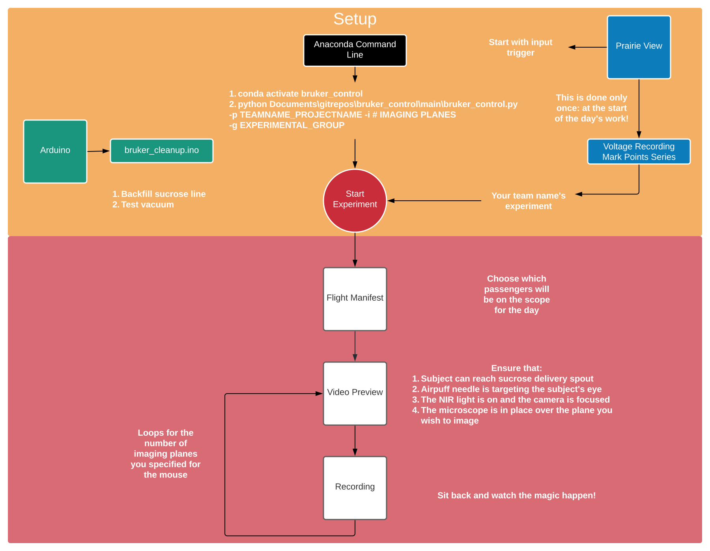
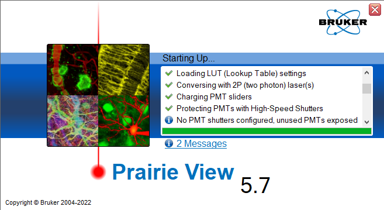

=====================================
 v1.9.2 User Guide: Get Yoked! 🏋️ 🏋️‍♀️ 
=====================================

A (very) basic rundown of the experimental runtime is included below.

##########
User Guide
##########

There are three different softwares used for running experiments with the lab's Bruker Ultima Investigator: *Python*, *Arduino Sketches*, and Bruker's *Prairie View*.

*********
*Arduino*
*********

First, use ``bruker_cleanup.ino`` to backfill the sucrose line.

1. Comment out all the lines in the `loop` portion of the file with `//` characters at the start of the line **except** for the `digitalWrite(solPin_liquid, HIGH)` line.
   
  * Assist the sucrose solution through the line with the syringe plunger until it is flowing continuously through the sucrose delivery needle in the faraday cage. It takes approximately 5mL of solution to backfill the line.

2. Uncomment the rest of the lines in the `loop` to test the vacuum. If the droplet is sucked up properly, you can move forward!

  * If it fails, first try drying the sucrose delivery needle and, if that fails, grease the interface between the two needles. Ensure that you don't get any grease where the sucrose droplet forms.

3. Upload your team's Arduino sketch! You only need to upload this sketch once: at the start of the day!

Now the Arduino system is ready and waiting for the experiment's trials!
The board will reset on its own once the imaging session is complete.

**************
*Prairie View*
**************

Prairie View will open several windows when it starts. The first looks like this:

In the currently running version (5.6.64.200), an error message appears
related to servo motors that do not exist in the Ultima Investigator. The
starting window shown above will end up looking like this:

.. image:: ../images/prairieview_servo_error.png
    :alt: Servo Error message
    :align: center

This has no influence upon the function of the system and can be ignored.

The next window is the primary window for Prairie View.

1. Primary Window: T-Series

.. image:: ../images/t_series_start.png
    :alt: T-Series tab
    :align: center

* In the `T-Series` tab, there's a box on the bottom left corner that states `Start with input trigger`. Make sure that this is selected.
* Make sure that there's a large number of images scheduled to be collected (>50k). This ensures that Prairie View will collect images for the full duration of the experiment. When the correct number of images are collected, `bruker_control` will send an `Abort` command to stop the experiment.
* Ensure that the `T-Series` is using the correct voltage recording experiment for your data before you start.
* If you are performing whole-field LED stimulations, ensure that the `Mark Points Series` is the correct one for team's experiment. These will have been configured ahead of time.

2. Preferences: Never Convert Images

.. image:: ../images/preferences_screenshot.png
    :alt: Preferences window
    :align: center

* Make sure that the `Never` option under the `Preferences/Convert Images` tab is selected.
  * This ensures that Prairie View will *not* convert the raw data into tiffs after the recording is complete. 

This process can take some time and Prairie View hangs until it is done. It can take 15-20 minutes to perform the conversion so you will not be able to start the next
subject until the ripping process is complete.

3. Voltage Recording Window

Select the Voltage Recording window from the `Electrophysiology Tab` to see the different experiments available on the system:

.. image:: ../images/voltage_recording_start.png
    :alt: Voltage Recording tab in electrophysiology
    :align: center

The voltage recording window will have multiple experiments saved for different teams' relevant DAQ channels. Select your team's appropriate experiment.

.. image:: ../images/voltage_recording_settings.png
    :alt: Voltage Recording Experiment Settings
    :align: center

At this point, Prairie View is ready to start imaging! You start the experiment in Python.

********
*Python*
********

.. image:: ../images/introduction_1.gif
    :alt: Example Command Line Execution
    :align: center

Use the `Anaconda Command Prompt` to start a Python Terminal and then type the following commands:

1. conda activate bruker_control

* Activating the conda environment `bruker_control` gives Python access to all the packages it needs to run the experiment.

2. ``python Documents\gitrepos\bruker_control\bruker_control.py -p TEAMNAME_PROJECT -i #IMAGINGPLANES -s SUBJECTID -g EXPERIMENTAL_GROUP``

The different arguments on this command line mean...

* -p The teamname and project that is using the system (ie specialk_cs) *REQUIRED*
* -i The number of imaging planes that you plan to image for your subject *REQUIRED*
* -s The subject ID for the animal being imaged *REQUIRED*
* -g The experimental group that the animal belongs to *OPTIONAL*

**************************
Using Yoked Configurations
**************************

If you have your configuration file set to use yoked trials, you *must* use the ``EXPERIMENTAL_GROUP`` argument.
This gives ``bruker_control`` the final piece of information needed for generating yoked trial-sets: which group the subject belongs to.
Yoked configurations are uniquely generated for each group on each day for each plane. There are two valid options:

* ``exp`` - Experimental group
* ``con`` - Control group

The command for each subject will therefore look something like this for an experimental animal:

* ``python Documents\gitrepos\bruker_control\bruker_control.py -p deryn_fd -i 1 -s DOL1 -g exp``

And will look something like this for a control animal:

* ``python Documents\gitrepos\bruker_control\bruker_control.py -p deryn_fd -i 1 -s DOL1 -g con``

If you specified ``yoked=true`` in your configuration but *DONT* have the ``EXPERIMENTAL_GROUP`` argument, ``bruker_control`` will attempt to continue
forward anyways and crash. Implementing a check and useful error message if the check fails is currently underway.
  
When you hit enter with this command line, things will get started right away! The next steps below describe the procedure.

****************
*The Experiment*
****************

There's not too much you need to do at this point! The steps are as follows:

1. A preview video will appear on the screen that shows the subject's face.
   
  * You may have already lined up the sucrose delivery needle and airpuff needles to their correct positions, but if you haven't now is when you should do that. 

2. At this point you should also ensure that the microscope's objective is lined up over the lens and lowered to the plane you wish to image.
3. Double check that the values of your PMTs and the laser are what you expect
4. When you're certain you're ready to go and that the Farraday cage is completely closed, you can hit the `Esc` key. This will start the experiment!
5. Watch the magic happen!

At this point, `bruker_control` takes care of the rest! It will automatically generate trial structures that comply with your rules, transmit them to the Arduino,
and tell Prairie View to start the recording session of the animal's face and brain activity. It will write out the experiment's information into the ``E:`` drive
appropriate for your team's raw data automatically so its ready for transferring to the server later.

*********************************
*Transferring Files to snlktdata*
*********************************

If your team has directories set for use on ``/snlktdata/_DATA/``, there's a ``.sh`` (shell script) that can automatically move your files to the server for you using a Linux
command called ``rsync`` through ``MobaXTerm``. It is simply called ``bruker_transfer_utility.sh``. Using it is simple after you open ``MobaXTerm`` and open a local terminal.

Once in the terminal, type the following:
``source ../Tyelab/MyDocuments/gitrepos/bruker_control/bruker_control/bruker_transfer_utility.sh TEAMNAME_PROJECT``

The commands in this line mean...

* source: This tells the Linux to run the file that is given to the command.
* ../Tyelab/MyDocuments/...: This is where the transfer utility is located in the git repository
*  TEAMNAME_PROJECT: This is the same as the -p argument in ``bruker_control``, the teamname and project (ie specialk_cs)

Once the transfer of the files is complete, you will receive an email message with the subject line "bruker_transfer_utility" that states the transfer is complete!
